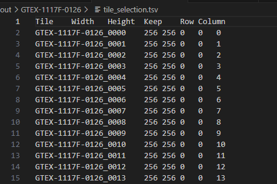

# HistologicalImagePreprocess
> 用 PyHIST + OpenSlide 把病理 WSI 切成深度学习可用的 patches

[](https://www.python.org/downloads/)
[](https://github.com/manuel-munoz-aguirre/PyHIST)
[](https://openslide.org/api/python/)

---

## 🎯 功能
- **读取** 病理切片（`.svs` ...）  
- **自动前景分割**（Otsu）  
- **多分辨率输出**（支持 40× / 20× / 10× 等）  
- **坐标文件** 与 **预览图** 一并生成，方便后续训练

---

## ⚡ Quick Start
### 1. 安装依赖
```bash
# 1) OpenSlide 二进制
pip install openslide-bin -i https://pypi.tuna.tsinghua.edu.cn/simple

# 2) 本项目已内建 PyHIST 源码，无需再 git clone
PyHIST（源码装）
git clone https://github.com/manuel-munoz-aguirre/PyHIST.git
cd PyHIST && pip install -e .

# 3) 下载一张svs格式的病理切片
素材源于nih https://brd.nci.nih.gov/brd/specimen/GTEX-1117F-0126
```

### 2. 一键切图示例

```python
from src.slide import PySlide, TileGenerator
import argparse, os, sys
sys.path.insert(0, os.path.abspath("PyHIST"))

args = argparse.Namespace(
    svs="demo.svs",                 # 待切 WSI
    patch_size=256,                 # 输出 patch 边长
    output_downsample=2,            # 20×
    content_threshold=0.3,
    thres=0.3,                      # 前景占比阈值
    method="otsu",                  # 无需编译
    save_patches=True,
    output="out",                   # 输出目录
    format="png",
    mask_downsample=16,
    save_tilecrossed_image=True,
    save_mask=True
)

slide = PySlide(vars(args))
TileGenerator(slide).execute()

```
运行后目录结构：
out/
├── *.png               # 256×256 patches  
├── tilecrossed_*.png   # 带网格预览图  
├── mask_*.png          # 前景掩膜  
└── tile_selection.tsv  # 坐标 & Keep 标记  


结果

| 原图裁剪 | 前景掩膜 | 网格预览 & 坐标 |
|---|---|---|
|  |  |  |
| Otsu 生成的组织掩膜 | 从 WSI 裁剪的局部区域 | 网格覆盖与被选 tile（蓝叉） |

---

## 📚 上游项目 & 引用

| 项目 | 用途 | 官方地址 |
|---|---|---|
| **PyHIST** | 病理切图核心 | [GitHub](https://github.com/manuel-munoz-aguirre/PyHIST) |
| **OpenSlide Python** | WSI 读取 | [官方文档](https://openslide.org/api/python/) |


若使用本工具发表成果，请同时引用原 PyHIST 论文：

```bibtex
@article{MunozAguirre2020,
  title   = {PyHIST: A Histological Image Segmentation Tool},
  author  = {Mu{\~{n}}oz-Aguirre, Manuel and Ntasis, Vasilis F. and Rojas, Santiago and Guig{\'{o}}, Roderic},
  journal = {PLOS Computational Biology},
  volume  = {16},
  number  = {10},
  pages   = {e1008349},
  year    = {2020},
  doi     = {10.1371/journal.pcbi.1008349},
  url     = {https://doi.org/10.1371/journal.pcbi.1008349}
}